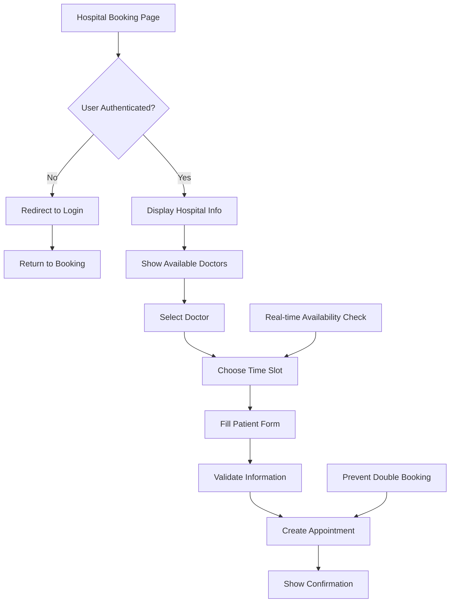

# Hospital Booking Page - Product Requirements Document

## 1. Product Overview
A comprehensive hospital appointment booking page that allows patients to book appointments at a specific hospital. The page provides a seamless booking experience by displaying hospital information, available doctors, time slots, and patient information collection, integrated with the existing hospital management system's Supabase schema.

The page addresses the critical need for patients to easily book appointments at their preferred hospital, targeting patients seeking medical services at a specific healthcare facility. This page serves as the final step in the patient journey from hospital discovery to appointment confirmation.

## 2. Core Features

### 2.1 User Roles
| Role | Registration Method | Core Permissions |
|------|---------------------|------------------|
| Authenticated Patient | Email registration with verification | Book appointments, view booking history, manage profile |
| Unauthenticated User | Redirected to login/signup | Must authenticate before booking |

### 2.2 Feature Module
The hospital booking page consists of the following main sections:

1. **Hospital Information Display**: Hospital details, contact information, services overview
2. **Doctor Selection**: Available doctors at the hospital with specialties and availability
3. **Time Slot Selection**: Interactive calendar with available appointment slots
4. **Patient Information Form**: Patient details collection and appointment reason
5. **Booking Confirmation**: Appointment summary and confirmation details

### 2.3 Page Details
| Page Name | Module Name | Feature description |
|-----------|-------------|---------------------|
| Hospital Booking | Hospital Header | Display hospital name, address, phone, and key services |
| Hospital Booking | Doctor Selection | Show available doctors with photos, specialties, experience, and availability status |
| Hospital Booking | Doctor Filter | Filter doctors by specialty, availability, and consultation fee |
| Hospital Booking | Calendar View | Interactive calendar showing available time slots for selected doctor |
| Hospital Booking | Time Slot Grid | Display available appointment times in 30-minute intervals |
| Hospital Booking | Patient Form | Collect patient personal information, contact details, and appointment reason |
| Hospital Booking | Appointment Summary | Show booking details including doctor, date, time, and patient information |
| Hospital Booking | Confirmation | Display booking confirmation with appointment ID and next steps |
| Hospital Booking | Authentication Check | Redirect unauthenticated users to login with return URL |
| Hospital Booking | Loading States | Show loading indicators during data fetching and form submission |
| Hospital Booking | Error Handling | Display user-friendly error messages for booking failures |

## 3. Core Process

**Patient Booking Flow:**
Patients navigate to the hospital booking page from the hospital detail page or direct URL. The system displays hospital information and available doctors. Patients select a doctor based on specialty and availability, then choose from available time slots in an interactive calendar. They fill out patient information including personal details and appointment reason. The system validates the information and creates the appointment, displaying a confirmation with appointment details and next steps.

**Authentication Flow:**
Unauthenticated users are redirected to the login page with a return URL to continue booking after authentication. The system preserves the hospital ID and any selected preferences during the authentication process.

**Data Validation Flow:**
The system validates doctor availability in real-time, prevents double-booking, checks patient information completeness, and ensures appointment slots are still available before final confirmation.

## 4. User Interface Design

### 4.1 Design Style
- **Primary Colors**: Medical blue (#2563eb), clean white (#ffffff)
- **Secondary Colors**: Soft gray (#f8fafc), success green (#10b981), warning amber (#f59e0b)
- **Button Style**: Rounded corners with subtle shadows, hover animations, primary blue for booking actions
- **Font**: Inter font family, 16px base size, clear hierarchy from 14px to 24px
- **Layout Style**: Multi-step card-based design with progress indicators, responsive grid layouts
- **Icons**: Medical icons (calendar, clock, user, stethoscope) from Lucide React
- **Components**: Shadcn/ui components for forms, calendars, buttons, and dialogs

### 4.2 Page Design Overview
| Page Name | Module Name | UI Elements |
|-----------|-------------|-------------|
| Hospital Booking | Hospital Header | Large hospital image, name overlay, contact information cards, services badges |
| Hospital Booking | Doctor Selection | Grid of doctor cards with photos, names, specialties, experience years, availability indicators |
| Hospital Booking | Doctor Filter | Sidebar with specialty dropdown, availability toggle, fee range slider |
| Hospital Booking | Calendar View | Monthly calendar with available dates highlighted in blue, unavailable dates grayed out |
| Hospital Booking | Time Slot Grid | Time buttons in 30-minute intervals, available slots in blue, booked slots disabled |
| Hospital Booking | Patient Form | Multi-section form with personal info, contact details, medical history, appointment reason |
| Hospital Booking | Progress Indicator | Step-by-step progress bar showing current booking stage (1. Doctor, 2. Time, 3. Details, 4. Confirm) |
| Hospital Booking | Appointment Summary | Card layout with booking details, doctor info, appointment time, patient information |
| Hospital Booking | Confirmation | Success message with appointment ID, calendar integration, next steps instructions |
| Hospital Booking | Loading States | Skeleton loaders for doctor cards, calendar, and form submission spinners |
| Hospital Booking | Error Messages | Toast notifications for errors, inline validation messages, retry buttons |

### 4.3 Responsiveness
The booking page is designed mobile-first with responsive breakpoints at 768px and 1024px. Mobile users get a stacked layout with full-width cards and touch-optimized time slot selection. Desktop users see a two-column layout with doctor selection on the left and booking details on the right. The calendar component adapts to screen size with appropriate touch targets for mobile devices.

## 5. Technical Integration

### 5.1 Database Schema Integration
The page integrates with existing Supabase tables:
- **hospitals**: Hospital information display
- **doctors**: Doctor selection and filtering
- **doctor_hospitals**: Doctor-hospital relationships
- **doctor_availability**: Available time slots
- **appointments**: Appointment creation
- **user_profiles**: Patient information
- **patients**: Patient medical history

### 5.2 API Requirements
- **GET /api/hospitals/[id]**: Fetch hospital details
- **GET /api/hospitals/[id]/doctors**: Get available doctors
- **GET /api/doctors/[id]/availability**: Fetch doctor availability
- **POST /api/appointments**: Create new appointment
- **GET /api/patients/profile**: Get patient information

### 5.3 Real-time Features
- Live availability checking to prevent double booking
- Real-time slot updates when other patients book
- Automatic session timeout handling
- Form auto-save for patient convenience

## 6. Success Metrics
- **Booking Completion Rate**: Percentage of users who complete the booking process
- **Time to Book**: Average time from page load to confirmation
- **Doctor Selection Rate**: Percentage of users who select a doctor
- **Mobile Conversion**: Booking completion rate on mobile devices
- **Error Rate**: Percentage of failed booking attempts
- **User Satisfaction**: Post-booking survey ratings

## 7. Future Enhancements
- **Multi-appointment Booking**: Book multiple appointments in one session
- **Recurring Appointments**: Schedule regular follow-up appointments
- **Insurance Integration**: Check insurance coverage and copay
- **Telemedicine Options**: Virtual appointment booking
- **Waitlist Feature**: Join waitlist for fully booked slots
- **Appointment Reminders**: SMS and email notifications