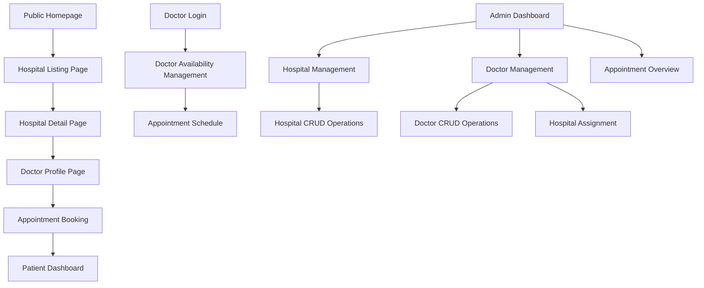

# Hospital Management System - Product Requirements Document

## 1. Product Overview
A comprehensive hospital management system with appointment booking capabilities that enables administrators to manage hospital and doctor data, doctors to manage their availability, and patients to book appointments while providing a public interface for healthcare facility discovery.

The system addresses the critical need for streamlined healthcare data management, doctor availability scheduling, and patient appointment booking, targeting healthcare administrators, medical professionals, and patients seeking medical services. This enhanced MVP includes appointment management while maintaining focus on core functionality and clean implementation.

## 2. Core Features

### 2.1 User Roles
| Role | Registration Method | Core Permissions |
|------|---------------------|------------------|
| Admin | Direct system access (no public registration) | Full CRUD operations on hospitals, doctors, and system management |
| Doctor | Email registration with admin approval | Manage availability, view appointments, update profile |
| Patient | Email registration with verification | Book appointments, view appointment history, manage profile |
| Public User | No registration required | Browse hospitals, search facilities, view doctor profiles |

### 2.2 Feature Module
Our enhanced hospital management system consists of the following main pages:

1. **Public Homepage**: Chat-style search interface, featured hospitals, navigation menu
2. **Hospital Listing Page**: Search results, filter options, hospital cards with key information
3. **Hospital Detail Page**: Complete hospital information, associated doctors list, contact details
4. **Doctor Profile Page**: Individual doctor details, availability calendar, appointment booking
5. **Patient Dashboard**: Appointment history, upcoming appointments, profile management
6. **Appointment Booking**: Multi-step booking process, time slot selection, confirmation
7. **Admin Dashboard**: System overview, quick actions, data management navigation
8. **Admin Hospital Management**: Hospital CRUD operations, bulk actions, data validation
9. **Admin Doctor Management**: Doctor CRUD operations, hospital assignments, specialty management
10. **Doctor Availability Management**: Schedule management, time slot configuration, availability status

### 2.3 Page Details
| Page Name | Module Name | Feature description |
|-----------|-------------|---------------------|
| Public Homepage | Hero Section | Display welcoming interface with prominent chat-style search box |
| Public Homepage | Chat Search Interface | Accept natural language queries about health issues or hospital needs |
| Public Homepage | Featured Hospitals | Show top-rated or featured hospitals with basic info cards |
| Hospital Listing Page | Search Results | Display hospitals matching search criteria with pagination |
| Hospital Listing Page | Filter System | Filter by city, specialty, services, ratings, and doctor availability |
| Hospital Listing Page | Hospital Cards | Show hospital name, city, specialties, contact info, brief description |
| Hospital Detail Page | Hospital Information | Display complete hospital details, services, facilities, contact information |
| Hospital Detail Page | Doctor Listings | Show all doctors associated with hospital including availability status |
| Hospital Detail Page | Contact & Location | Display address, phone numbers, email, operating hours, map integration |
| Doctor Profile Page | Doctor Information | Display doctor details, specialties, experience, education, bio |
| Doctor Profile Page | Availability Calendar | Show doctor's available time slots for appointment booking |
| Doctor Profile Page | Appointment Booking | Allow patients to select time slots and book appointments |
| Patient Dashboard | Appointment History | Display past and upcoming appointments with status tracking |
| Patient Dashboard | Profile Management | Allow patients to update personal information and preferences |
| Patient Dashboard | Quick Actions | Provide shortcuts to book new appointments and view recent activity |
| Appointment Booking | Doctor Selection | Choose doctor based on specialty, availability, and hospital |
| Appointment Booking | Time Slot Selection | Select available appointment slots from doctor's calendar |
| Appointment Booking | Patient Information | Collect patient details and appointment reason |
| Appointment Booking | Confirmation | Display booking summary and confirmation details |
| Admin Dashboard | Overview Statistics | Show total hospitals, doctors, appointments, recent activities |
| Admin Dashboard | Quick Actions | Provide shortcuts to add new hospitals, doctors, and manage appointments |
| Admin Hospital Management | Hospital CRUD | Create, read, update, delete hospital records with form validation |
| Admin Hospital Management | Bulk Operations | Import/export hospital data, bulk updates, data management tools |
| Admin Doctor Management | Doctor CRUD | Create, read, update, delete doctor profiles with comprehensive fields |
| Admin Doctor Management | Hospital Assignment | Manage many-to-many relationships between doctors and hospitals |
| Admin Doctor Management | Specialty Management | Assign and manage medical specialties, experience tracking |
| Doctor Availability Management | Schedule Configuration | Set working hours, days off, and recurring availability patterns |
| Doctor Availability Management | Time Slot Management | Create, modify, and delete specific appointment time slots |
| Doctor Availability Management | Availability Status | Toggle availability status (available, busy, off-duty, on-leave) |

## 3. Core Process

**Public User Flow:**
Users visit the homepage and interact with the chat-style search interface by describing their health needs or specifying requirements. The system processes their input and displays relevant hospitals on the listing page. Users can apply additional filters to refine results, then click on hospital cards to view detailed information including associated doctors and their availability status.

**Patient Flow:**
Registered patients can search for doctors by specialty or hospital, view doctor profiles with availability calendars, and book appointments by selecting available time slots. They can manage their appointments through the patient dashboard, view appointment history, and update their profile information.

**Doctor Flow:**
Doctors log in to manage their availability by setting working hours, creating time slots, and updating their availability status. They can view their appointment schedule, update their profile information, and manage their association with multiple hospitals.

**Admin Flow:**
Administrators access the admin dashboard to view comprehensive system statistics including hospitals, doctors, and appointments. They can navigate to hospital management to perform CRUD operations on hospital records, access doctor management to create doctor profiles and assign them to multiple hospitals, and oversee the appointment system. The system maintains data integrity through proper relationship modeling.

## 4. User Interface Design

### 4.1 Design Style
- **Primary Colors**: Medical blue (#2563eb), clean white (#ffffff)
- **Secondary Colors**: Soft gray (#f8fafc), accent green (#10b981) for success states, warning amber (#f59e0b) for pending appointments
- **Button Style**: Rounded corners with subtle shadows, hover animations, shadcn/ui component styling
- **Font**: Inter or system fonts, 16px base size, clear hierarchy with 14px-24px range
- **Layout Style**: Card-based design with clean spacing, top navigation with breadcrumbs, responsive grid layouts
- **Icons**: Medical-themed icons (stethoscope, hospital cross, calendar, clock), modern outline style from Lucide React
- **Components**: Shadcn/ui components for consistent design system (buttons, forms, dialogs, calendars)

### 4.2 Page Design Overview
| Page Name | Module Name | UI Elements |
|-----------|-------------|-------------|
| Public Homepage | Hero Section | Large background image, centered chat input with medical blue accent, clean typography |
| Public Homepage | Chat Search Interface | Rounded input field with placeholder text, send button with icon, conversation-style layout |
| Hospital Listing Page | Search Results | Grid layout with hospital cards, clean shadows, responsive design |
| Hospital Listing Page | Filter System | Sidebar filters with checkboxes, dropdowns, clear visual hierarchy |
| Hospital Detail Page | Hospital Information | Two-column layout, image gallery, structured information blocks |
| Hospital Detail Page | Doctor Listings | Card-based doctor profiles with photos, specialties, availability indicators |
| Doctor Profile Page | Doctor Information | Professional layout with photo, credentials, bio, contact information |
| Doctor Profile Page | Availability Calendar | Interactive calendar component showing available/booked time slots |
| Doctor Profile Page | Appointment Booking | Step-by-step booking form with time selection and patient details |
| Patient Dashboard | Appointment History | Timeline view with appointment cards, status badges, action buttons |
| Patient Dashboard | Profile Management | Form-based profile editing with validation and save confirmation |
| Appointment Booking | Multi-step Process | Progress indicator, form validation, confirmation screens |
| Admin Dashboard | Overview Statistics | Dashboard cards with icons, charts, color-coded metrics, real-time updates |
| Admin Hospital Management | Hospital CRUD | Form-based interface with validation, modal dialogs, data tables |
| Admin Doctor Management | Doctor CRUD | Multi-step forms, hospital selection interface, relationship management |
| Doctor Availability Management | Schedule Interface | Calendar view with drag-and-drop time slot creation, status toggles |

### 4.3 Responsiveness
The system is designed mobile-first with responsive breakpoints at 768px and 1024px. Touch interactions are optimized for mobile users browsing hospital information and booking appointments, while admin and doctor interfaces prioritize desktop usability with keyboard shortcuts and efficient data entry workflows. The appointment booking process is fully optimized for mobile devices with large touch targets and simplified navigation.