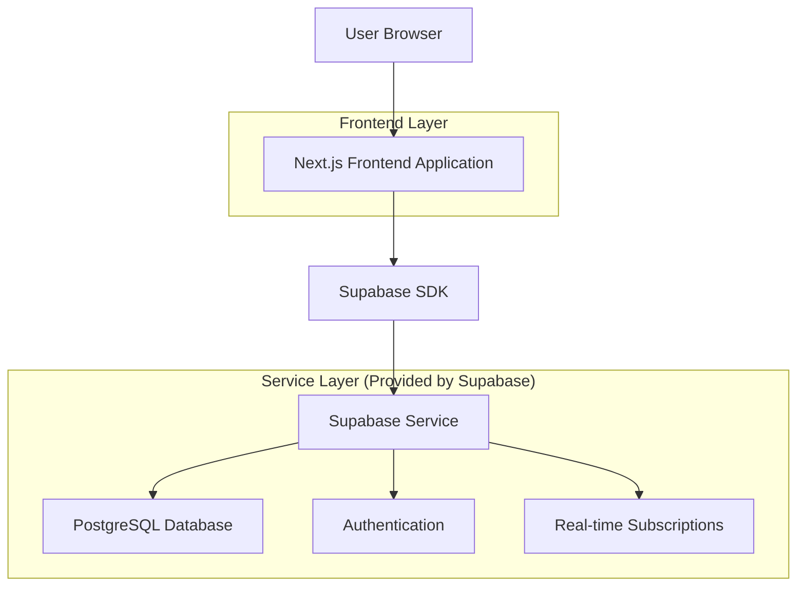
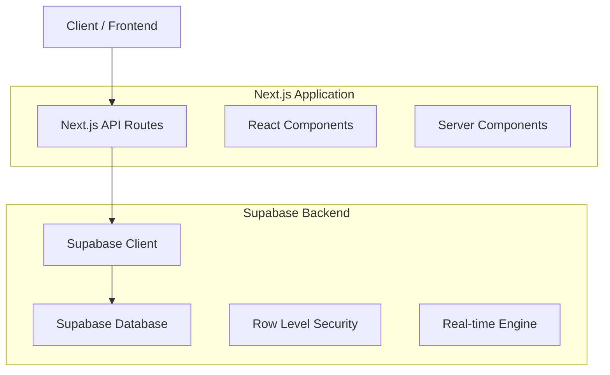
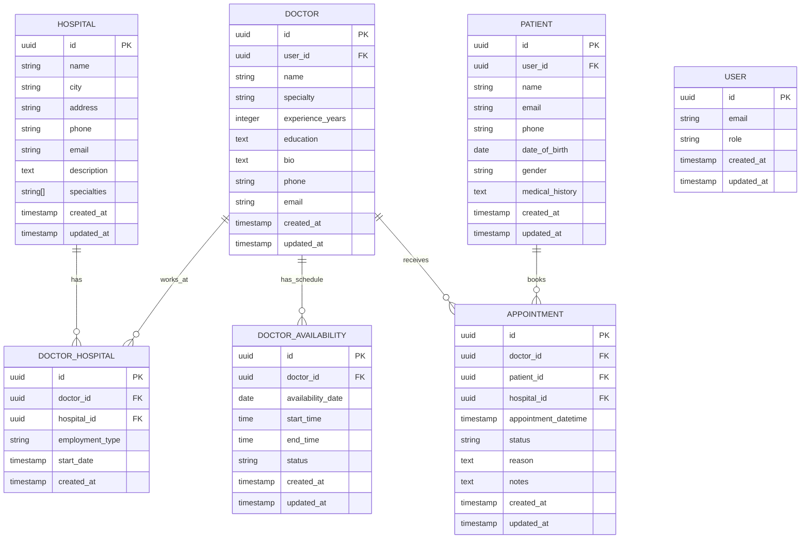

# Hospital Management System - Technical Architecture Document

## 1. Architecture Design



## 2. Technology Description

- **Frontend**: Next.js@14 + TypeScript + Tailwind CSS + React@18
- **UI Components**: Shadcn/ui component library with Radix UI primitives
- **Backend**: Supabase (PostgreSQL database, authentication, real-time features)
- **Styling**: Tailwind CSS for responsive design and component styling
- **State Management**: React hooks, Context API, and Zustand for complex state
- **Form Handling**: React Hook Form with Zod validation
- **Icons**: Lucide React for consistent iconography
- **Date/Time**: date-fns for date manipulation and formatting

## 3. Route Definitions

| Route | Purpose |
|-------|---------|
| / | Public homepage with chat-style search interface |
| /hospitals | Hospital listing page with search results and filters |
| /hospitals/[id] | Hospital detail page showing full information and doctors |
| /doctors/[id] | Doctor profile page with availability and booking |
| /auth/login | User authentication (patients and doctors) |
| /auth/register | User registration for patients |
| /patient/dashboard | Patient dashboard with appointments and profile |
| /patient/appointments | Patient appointment history and management |
| /patient/book/[doctorId] | Appointment booking flow for specific doctor |
| /doctor/dashboard | Doctor dashboard with schedule and appointments |
| /doctor/availability | Doctor availability management interface |
| /doctor/appointments | Doctor appointment schedule and patient management |
| /admin | Admin dashboard with system overview and statistics |
| /admin/hospitals | Hospital management interface with CRUD operations |
| /admin/hospitals/[id] | Individual hospital edit/view page |
| /admin/doctors | Doctor management interface with CRUD operations |
| /admin/doctors/[id] | Individual doctor edit/view page |
| /admin/appointments | Admin appointment oversight and management |

## 4. API Definitions

### 4.1 Core API

**Hospital Management**
```
GET /api/hospitals
```
Request:
| Param Name | Param Type | isRequired | Description |
|------------|------------|------------|-------------|
| search | string | false | Search query for hospital name or specialty |
| city | string | false | Filter by city |
| specialty | string | false | Filter by medical specialty |
| page | number | false | Pagination page number |
| limit | number | false | Number of results per page |

Response:
| Param Name | Param Type | Description |
|------------|------------|-------------|
| hospitals | Hospital[] | Array of hospital objects |
| total | number | Total number of hospitals |
| page | number | Current page number |

**Doctor Management**
```
GET /api/doctors
```
Request:
| Param Name | Param Type | isRequired | Description |
|------------|------------|------------|-------------|
| hospital_id | string | false | Filter doctors by hospital |
| specialty | string | false | Filter by medical specialty |
| experience_min | number | false | Minimum years of experience |
| available_date | string | false | Filter by availability date (YYYY-MM-DD) |

Response:
| Param Name | Param Type | Description |
|------------|------------|-------------|
| doctors | Doctor[] | Array of doctor objects with availability |
| total | number | Total number of doctors |

**Appointment Management**
```
GET /api/appointments
```
Request:
| Param Name | Param Type | isRequired | Description |
|------------|------------|------------|-------------|
| patient_id | string | false | Filter by patient ID |
| doctor_id | string | false | Filter by doctor ID |
| status | string | false | Filter by appointment status |
| date_from | string | false | Start date filter (YYYY-MM-DD) |
| date_to | string | false | End date filter (YYYY-MM-DD) |

Response:
| Param Name | Param Type | Description |
|------------|------------|-------------|
| appointments | Appointment[] | Array of appointment objects |
| total | number | Total number of appointments |

```
POST /api/appointments
```
Request:
| Param Name | Param Type | isRequired | Description |
|------------|------------|------------|-------------|
| doctor_id | string | true | Doctor ID |
| patient_id | string | true | Patient ID |
| appointment_date | string | true | Appointment date (ISO string) |
| appointment_time | string | true | Appointment time slot |
| reason | string | false | Reason for appointment |
| notes | string | false | Additional notes |

**Doctor Availability**
```
GET /api/doctors/[id]/availability
```
Request:
| Param Name | Param Type | isRequired | Description |
|------------|------------|------------|-------------|
| date_from | string | true | Start date (YYYY-MM-DD) |
| date_to | string | true | End date (YYYY-MM-DD) |

Response:
| Param Name | Param Type | Description |
|------------|------------|-------------|
| availability | AvailabilitySlot[] | Array of available time slots |
| doctor_id | string | Doctor ID |

```
POST /api/doctors/[id]/availability
```
Request:
| Param Name | Param Type | isRequired | Description |
|------------|------------|------------|-------------|
| date | string | true | Date (YYYY-MM-DD) |
| start_time | string | true | Start time (HH:MM) |
| end_time | string | true | End time (HH:MM) |
| status | string | true | Availability status (available, busy, off-duty) |

## 5. Server Architecture Diagram



## 6. Data Model

### 6.1 Data Model Definition



### 6.2 Data Definition Language

**Hospital Table (hospitals)**
```sql
-- Create hospitals table
CREATE TABLE hospitals (
    id UUID PRIMARY KEY DEFAULT gen_random_uuid(),
    name VARCHAR(255) NOT NULL,
    city VARCHAR(100) NOT NULL,
    address TEXT NOT NULL,
    phone VARCHAR(20) NOT NULL,
    email VARCHAR(255) NOT NULL,
    description TEXT,
    specialties TEXT[] DEFAULT '{}',
    created_at TIMESTAMP WITH TIME ZONE DEFAULT NOW(),
    updated_at TIMESTAMP WITH TIME ZONE DEFAULT NOW()
);

-- Create indexes
CREATE INDEX idx_hospitals_city ON hospitals(city);
CREATE INDEX idx_hospitals_specialties ON hospitals USING GIN(specialties);
CREATE INDEX idx_hospitals_name ON hospitals(name);

-- Enable RLS
ALTER TABLE hospitals ENABLE ROW LEVEL SECURITY;

-- Create policies
CREATE POLICY "Allow public read access" ON hospitals FOR SELECT TO anon USING (true);
CREATE POLICY "Allow authenticated full access" ON hospitals FOR ALL TO authenticated USING (true);
```

**Doctor Table (doctors)**
```sql
-- Create doctors table
CREATE TABLE doctors (
    id UUID PRIMARY KEY DEFAULT gen_random_uuid(),
    name VARCHAR(255) NOT NULL,
    specialty VARCHAR(100) NOT NULL,
    experience_years INTEGER NOT NULL CHECK (experience_years >= 0),
    education TEXT,
    bio TEXT,
    phone VARCHAR(20),
    email VARCHAR(255),
    created_at TIMESTAMP WITH TIME ZONE DEFAULT NOW(),
    updated_at TIMESTAMP WITH TIME ZONE DEFAULT NOW()
);

-- Create indexes
CREATE INDEX idx_doctors_specialty ON doctors(specialty);
CREATE INDEX idx_doctors_experience ON doctors(experience_years);
CREATE INDEX idx_doctors_name ON doctors(name);

-- Enable RLS
ALTER TABLE doctors ENABLE ROW LEVEL SECURITY;

-- Create policies
CREATE POLICY "Allow public read access" ON doctors FOR SELECT TO anon USING (true);
CREATE POLICY "Allow authenticated full access" ON doctors FOR ALL TO authenticated USING (true);
```

**User Table (users) - Supabase Auth Integration**
```sql
-- Users table is managed by Supabase Auth, but we can add custom fields
-- This extends the auth.users table with additional profile information
CREATE TABLE user_profiles (
    id UUID PRIMARY KEY REFERENCES auth.users(id) ON DELETE CASCADE,
    role VARCHAR(20) NOT NULL CHECK (role IN ('admin', 'doctor', 'patient')),
    created_at TIMESTAMP WITH TIME ZONE DEFAULT NOW(),
    updated_at TIMESTAMP WITH TIME ZONE DEFAULT NOW()
);

-- Enable RLS
ALTER TABLE user_profiles ENABLE ROW LEVEL SECURITY;

-- Create policies
CREATE POLICY "Users can view own profile" ON user_profiles FOR SELECT USING (auth.uid() = id);
CREATE POLICY "Users can update own profile" ON user_profiles FOR UPDATE USING (auth.uid() = id);
CREATE POLICY "Allow authenticated full access" ON user_profiles FOR ALL TO authenticated USING (true);
```

**Patient Table (patients)**
```sql
-- Create patients table
CREATE TABLE patients (
    id UUID PRIMARY KEY DEFAULT gen_random_uuid(),
    user_id UUID NOT NULL REFERENCES auth.users(id) ON DELETE CASCADE,
    name VARCHAR(255) NOT NULL,
    email VARCHAR(255) NOT NULL,
    phone VARCHAR(20),
    date_of_birth DATE,
    gender VARCHAR(10) CHECK (gender IN ('male', 'female', 'other')),
    medical_history TEXT,
    created_at TIMESTAMP WITH TIME ZONE DEFAULT NOW(),
    updated_at TIMESTAMP WITH TIME ZONE DEFAULT NOW(),
    UNIQUE(user_id)
);

-- Create indexes
CREATE INDEX idx_patients_user_id ON patients(user_id);
CREATE INDEX idx_patients_email ON patients(email);

-- Enable RLS
ALTER TABLE patients ENABLE ROW LEVEL SECURITY;

-- Create policies
CREATE POLICY "Patients can view own data" ON patients FOR SELECT USING (auth.uid() = user_id);
CREATE POLICY "Patients can update own data" ON patients FOR UPDATE USING (auth.uid() = user_id);
CREATE POLICY "Allow authenticated full access" ON patients FOR ALL TO authenticated USING (true);
```

**Doctor Table (doctors) - Updated**
```sql
-- Create doctors table with user reference
CREATE TABLE doctors (
    id UUID PRIMARY KEY DEFAULT gen_random_uuid(),
    user_id UUID REFERENCES auth.users(id) ON DELETE SET NULL,
    name VARCHAR(255) NOT NULL,
    specialty VARCHAR(100) NOT NULL,
    experience_years INTEGER NOT NULL CHECK (experience_years >= 0),
    education TEXT,
    bio TEXT,
    phone VARCHAR(20),
    email VARCHAR(255),
    created_at TIMESTAMP WITH TIME ZONE DEFAULT NOW(),
    updated_at TIMESTAMP WITH TIME ZONE DEFAULT NOW()
);

-- Create indexes
CREATE INDEX idx_doctors_user_id ON doctors(user_id);
CREATE INDEX idx_doctors_specialty ON doctors(specialty);
CREATE INDEX idx_doctors_experience ON doctors(experience_years);
CREATE INDEX idx_doctors_name ON doctors(name);

-- Enable RLS
ALTER TABLE doctors ENABLE ROW LEVEL SECURITY;

-- Create policies
CREATE POLICY "Allow public read access" ON doctors FOR SELECT TO anon USING (true);
CREATE POLICY "Doctors can update own data" ON doctors FOR UPDATE USING (auth.uid() = user_id);
CREATE POLICY "Allow authenticated full access" ON doctors FOR ALL TO authenticated USING (true);
```

**Doctor-Hospital Junction Table (doctor_hospital)**
```sql
-- Create doctor_hospital junction table
CREATE TABLE doctor_hospital (
    id UUID PRIMARY KEY DEFAULT gen_random_uuid(),
    doctor_id UUID NOT NULL REFERENCES doctors(id) ON DELETE CASCADE,
    hospital_id UUID NOT NULL REFERENCES hospitals(id) ON DELETE CASCADE,
    employment_type VARCHAR(50) DEFAULT 'full-time' CHECK (employment_type IN ('full-time', 'part-time', 'visiting', 'consultant')),
    start_date DATE DEFAULT CURRENT_DATE,
    created_at TIMESTAMP WITH TIME ZONE DEFAULT NOW(),
    UNIQUE(doctor_id, hospital_id)
);

-- Create indexes
CREATE INDEX idx_doctor_hospital_doctor_id ON doctor_hospital(doctor_id);
CREATE INDEX idx_doctor_hospital_hospital_id ON doctor_hospital(hospital_id);

-- Enable RLS
ALTER TABLE doctor_hospital ENABLE ROW LEVEL SECURITY;

-- Create policies
CREATE POLICY "Allow public read access" ON doctor_hospital FOR SELECT TO anon USING (true);
CREATE POLICY "Allow authenticated full access" ON doctor_hospital FOR ALL TO authenticated USING (true);
```

**Doctor Availability Table (doctor_availability)**
```sql
-- Create doctor_availability table
CREATE TABLE doctor_availability (
    id UUID PRIMARY KEY DEFAULT gen_random_uuid(),
    doctor_id UUID NOT NULL REFERENCES doctors(id) ON DELETE CASCADE,
    availability_date DATE NOT NULL,
    start_time TIME NOT NULL,
    end_time TIME NOT NULL,
    status VARCHAR(20) DEFAULT 'available' CHECK (status IN ('available', 'busy', 'off-duty', 'on-leave')),
    created_at TIMESTAMP WITH TIME ZONE DEFAULT NOW(),
    updated_at TIMESTAMP WITH TIME ZONE DEFAULT NOW(),
    UNIQUE(doctor_id, availability_date, start_time)
);

-- Create indexes
CREATE INDEX idx_doctor_availability_doctor_id ON doctor_availability(doctor_id);
CREATE INDEX idx_doctor_availability_date ON doctor_availability(availability_date);
CREATE INDEX idx_doctor_availability_status ON doctor_availability(status);

-- Enable RLS
ALTER TABLE doctor_availability ENABLE ROW LEVEL SECURITY;

-- Create policies
CREATE POLICY "Allow public read access" ON doctor_availability FOR SELECT TO anon USING (true);
CREATE POLICY "Doctors can manage own availability" ON doctor_availability FOR ALL USING (
    doctor_id IN (SELECT id FROM doctors WHERE user_id = auth.uid())
);
CREATE POLICY "Allow authenticated full access" ON doctor_availability FOR ALL TO authenticated USING (true);
```

**Appointment Table (appointments)**
```sql
-- Create appointments table
CREATE TABLE appointments (
    id UUID PRIMARY KEY DEFAULT gen_random_uuid(),
    doctor_id UUID NOT NULL REFERENCES doctors(id) ON DELETE CASCADE,
    patient_id UUID NOT NULL REFERENCES patients(id) ON DELETE CASCADE,
    hospital_id UUID NOT NULL REFERENCES hospitals(id) ON DELETE CASCADE,
    appointment_datetime TIMESTAMP WITH TIME ZONE NOT NULL,
    status VARCHAR(20) DEFAULT 'pending' CHECK (status IN ('pending', 'confirmed', 'completed', 'cancelled', 'no-show')),
    reason TEXT,
    notes TEXT,
    created_at TIMESTAMP WITH TIME ZONE DEFAULT NOW(),
    updated_at TIMESTAMP WITH TIME ZONE DEFAULT NOW()
);

-- Create indexes
CREATE INDEX idx_appointments_doctor_id ON appointments(doctor_id);
CREATE INDEX idx_appointments_patient_id ON appointments(patient_id);
CREATE INDEX idx_appointments_hospital_id ON appointments(hospital_id);
CREATE INDEX idx_appointments_datetime ON appointments(appointment_datetime);
CREATE INDEX idx_appointments_status ON appointments(status);

-- Enable RLS
ALTER TABLE appointments ENABLE ROW LEVEL SECURITY;

-- Create policies
CREATE POLICY "Patients can view own appointments" ON appointments FOR SELECT USING (
    patient_id IN (SELECT id FROM patients WHERE user_id = auth.uid())
);
CREATE POLICY "Doctors can view own appointments" ON appointments FOR SELECT USING (
    doctor_id IN (SELECT id FROM doctors WHERE user_id = auth.uid())
);
CREATE POLICY "Patients can create appointments" ON appointments FOR INSERT WITH CHECK (
    patient_id IN (SELECT id FROM patients WHERE user_id = auth.uid())
);
CREATE POLICY "Allow authenticated full access" ON appointments FOR ALL TO authenticated USING (true);

-- Insert sample data
INSERT INTO hospitals (name, city, address, phone, email, description, specialties) VALUES
('City General Hospital', 'New York', '123 Main St, New York, NY 10001', '+1-555-0101', 'info@citygeneral.com', 'Leading healthcare facility providing comprehensive medical services', ARRAY['Cardiology', 'Neurology', 'Emergency Medicine']),
('Metro Medical Center', 'Los Angeles', '456 Health Ave, Los Angeles, CA 90210', '+1-555-0102', 'contact@metromedical.com', 'Advanced medical center specializing in specialized care', ARRAY['Oncology', 'Orthopedics', 'Pediatrics']),
('Regional Health Institute', 'Chicago', '789 Care Blvd, Chicago, IL 60601', '+1-555-0103', 'info@regionalhealth.com', 'Community-focused hospital with modern facilities', ARRAY['Internal Medicine', 'Surgery', 'Radiology']);

INSERT INTO doctors (name, specialty, experience_years, education, bio, phone, email) VALUES
('Dr. Sarah Johnson', 'Cardiology', 15, 'MD from Harvard Medical School', 'Experienced cardiologist specializing in interventional procedures', '+1-555-1001', 'sarah.johnson@citygeneral.com'),
('Dr. Michael Chen', 'Neurology', 12, 'MD from Johns Hopkins University', 'Neurologist with expertise in stroke treatment and brain disorders', '+1-555-1002', 'michael.chen@metromedical.com'),
('Dr. Emily Rodriguez', 'Pediatrics', 8, 'MD from Stanford University', 'Dedicated pediatrician focused on child healthcare and development', '+1-555-1003', 'emily.rodriguez@regionalhealth.com');

-- Link doctors to hospitals
INSERT INTO doctor_hospital (doctor_id, hospital_id, employment_type) VALUES
((SELECT id FROM doctors WHERE name = 'Dr. Sarah Johnson'), (SELECT id FROM hospitals WHERE name = 'City General Hospital'), 'full-time'),
((SELECT id FROM doctors WHERE name = 'Dr. Michael Chen'), (SELECT id FROM hospitals WHERE name = 'Metro Medical Center'), 'full-time'),
((SELECT id FROM doctors WHERE name = 'Dr. Emily Rodriguez'), (SELECT id FROM hospitals WHERE name = 'Regional Health Institute'), 'full-time');

-- Sample availability data
INSERT INTO doctor_availability (doctor_id, availability_date, start_time, end_time, status) VALUES
((SELECT id FROM doctors WHERE name = 'Dr. Sarah Johnson'), CURRENT_DATE + INTERVAL '1 day', '09:00', '17:00', 'available'),
((SELECT id FROM doctors WHERE name = 'Dr. Michael Chen'), CURRENT_DATE + INTERVAL '1 day', '08:00', '16:00', 'available'),
((SELECT id FROM doctors WHERE name = 'Dr. Emily Rodriguez'), CURRENT_DATE + INTERVAL '1 day', '10:00', '18:00', 'available');
```