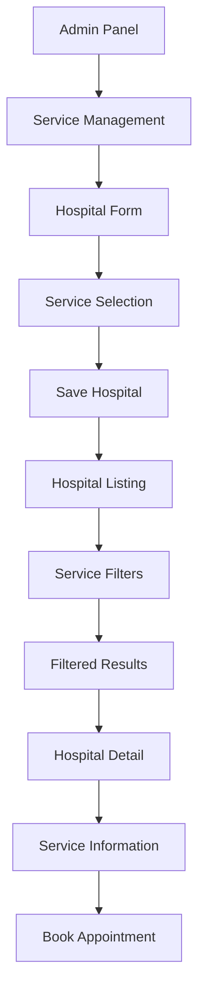

# Hospital Services Feature - Product Requirements Document

## 1. Product Overview
This document outlines the requirements for adding hospital services functionality to the existing hospital management system. The feature will allow hospitals to specify and manage multiple medical services they offer, enabling patients to search and filter hospitals based on available services.

- **Problem to solve**: Currently, hospitals in the system lack detailed service information, making it difficult for patients to find hospitals that offer specific medical services they need.
- **Target users**: Hospital administrators (for managing services) and patients (for discovering services).
- **Value proposition**: Enhanced hospital discovery through service-based filtering and improved patient experience in finding appropriate healthcare facilities.

## 2. Core Features

### 2.1 User Roles
| Role | Registration Method | Core Permissions |
|------|---------------------|------------------|
| Admin | System-assigned | Can manage all hospital services, create/edit/delete service categories |
| Hospital Staff | Admin invitation | Can manage services for their assigned hospitals |
| Patient | Email registration | Can view and filter hospitals by services |

### 2.2 Feature Module
Our hospital services requirements consist of the following main pages and components:
1. **Hospital Add/Edit Form**: Enhanced form with multiple service selection capability
2. **Hospital Listing Page**: Dynamic service display with filtering options
3. **Hospital Detail Page**: Comprehensive service information display
4. **Admin Services Management**: Service category management interface

### 2.3 Page Details
| Page Name | Module Name | Feature description |
|-----------|-------------|---------------------|
| Hospital Form | Service Selection | Multi-select dropdown for choosing hospital services. Support for adding custom services. Validation for required service categories. |
| Hospital Listing | Service Filters | Filter hospitals by service categories. Display service badges on hospital cards. Search functionality including services. |
| Hospital Detail | Service Display | Comprehensive list of hospital services with descriptions. Service categorization and icons. Contact information for specific services. |
| Admin Dashboard | Service Management | Create, edit, delete service categories. Manage service descriptions and icons. View service usage statistics. |

## 3. Core Process

### Admin Flow
1. Admin accesses service management dashboard
2. Creates/edits service categories with descriptions and icons
3. Manages hospital service assignments
4. Reviews service usage analytics

### Hospital Management Flow
1. Hospital staff logs into admin panel
2. Navigates to hospital edit form
3. Selects multiple services from categorized list
4. Saves hospital with updated service information
5. Services appear on public hospital listing

### Patient Discovery Flow
1. Patient visits hospital listing page
2. Uses service filters to narrow down options
3. Views hospital cards with service badges
4. Clicks on hospital for detailed service information
5. Books appointment based on available services



## 4. User Interface Design

### 4.1 Design Style
- **Primary colors**: Medical blue (#2563eb) and healthcare green (#059669)
- **Secondary colors**: Light gray (#f8fafc) for backgrounds, dark gray (#1f2937) for text
- **Button style**: Rounded corners (8px), medical-themed with subtle shadows
- **Font**: Inter or system fonts, 14px base size for forms, 16px for content
- **Layout style**: Card-based design with clean spacing, consistent with existing hospital management UI
- **Icons**: Medical and service-specific icons (Lucide React icons preferred)

### 4.2 Page Design Overview
| Page Name | Module Name | UI Elements |
|-----------|-------------|-------------|
| Hospital Form | Service Selection | Multi-select dropdown with search, service categories with icons, selected services display as removable badges |
| Hospital Listing | Service Filters | Sidebar filters with checkboxes, service badges on cards, filter count indicators |
| Hospital Detail | Service Display | Service grid layout with icons, service categories with descriptions, contact buttons for specific services |
| Admin Dashboard | Service Management | Data table for services, modal forms for editing, drag-and-drop for service ordering |

### 4.3 Responsiveness
The feature is designed mobile-first with responsive breakpoints:
- **Mobile (320px-768px)**: Stacked service filters, collapsible service sections
- **Tablet (768px-1024px)**: Side-by-side layout with condensed filters
- **Desktop (1024px+)**: Full sidebar filters, grid-based service display
- **Touch optimization**: Large touch targets for service selection, swipe gestures for mobile filters

## 5. Technical Requirements

### 5.1 Database Schema Changes
```sql
-- Create hospital_services table for predefined services
CREATE TABLE hospital_services (
    id UUID DEFAULT uuid_generate_v4() PRIMARY KEY,
    name TEXT NOT NULL UNIQUE,
    description TEXT,
    category TEXT NOT NULL,
    icon_name TEXT,
    is_active BOOLEAN DEFAULT true,
    created_at TIMESTAMP WITH TIME ZONE DEFAULT NOW(),
    updated_at TIMESTAMP WITH TIME ZONE DEFAULT NOW()
);

-- Create hospital_service_assignments junction table
CREATE TABLE hospital_service_assignments (
    id UUID DEFAULT uuid_generate_v4() PRIMARY KEY,
    hospital_id UUID REFERENCES hospitals(id) ON DELETE CASCADE NOT NULL,
    service_id UUID REFERENCES hospital_services(id) ON DELETE CASCADE NOT NULL,
    created_at TIMESTAMP WITH TIME ZONE DEFAULT NOW(),
    UNIQUE(hospital_id, service_id)
);
```

### 5.2 Service Categories
- **Emergency Services**: Emergency Care, Trauma Center, Ambulance Services
- **Specialized Care**: Cardiology, Neurology, Oncology, Orthopedics, Pediatrics
- **Surgical Services**: General Surgery, Cardiac Surgery, Neurosurgery, Plastic Surgery
- **Diagnostic Services**: Radiology, Laboratory, MRI, CT Scan, Ultrasound
- **Outpatient Services**: Consultation, Physical Therapy, Rehabilitation
- **Maternity Services**: Obstetrics, Gynecology, Neonatal Care
- **Mental Health**: Psychiatry, Psychology, Counseling

### 5.3 API Endpoints
- `GET /api/hospital-services` - Fetch all available services
- `GET /api/hospitals/{id}/services` - Get services for specific hospital
- `POST /api/hospitals/{id}/services` - Assign services to hospital
- `DELETE /api/hospitals/{id}/services/{serviceId}` - Remove service from hospital
- `GET /api/hospitals?services=[]` - Filter hospitals by services

### 5.4 Form Validation
- At least one service must be selected for each hospital
- Service selection limited to active services only
- Custom service requests require admin approval
- Duplicate service assignments prevented at database level