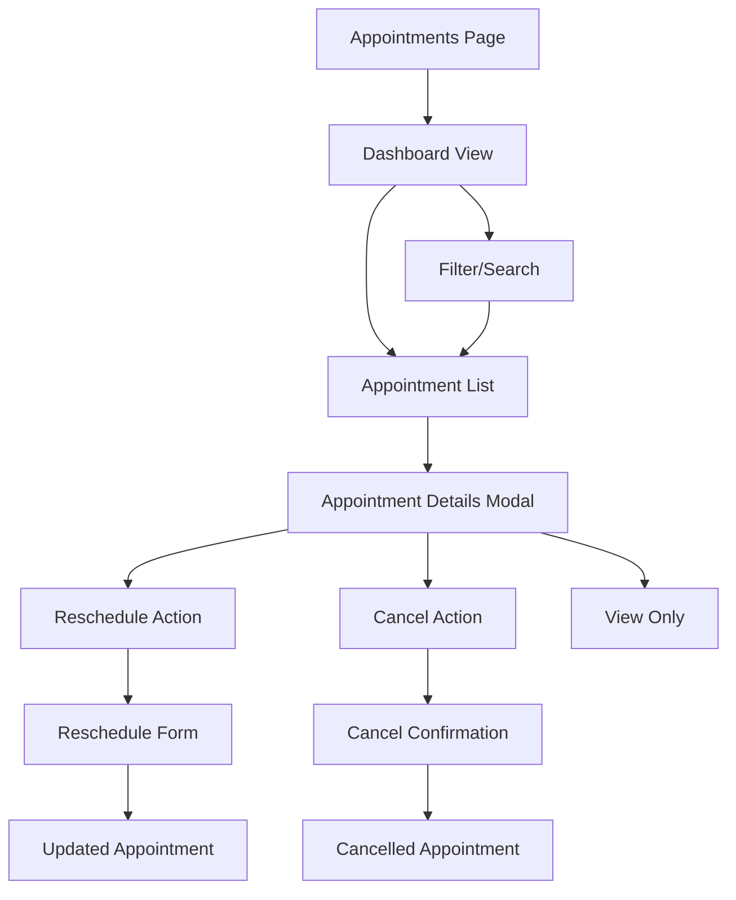

# Appointments Page - Product Requirements Document

## 1. Product Overview
The Appointments page provides patients with a comprehensive view of their medical appointments, allowing them to manage their healthcare schedule efficiently. This centralized dashboard displays past, current, and upcoming appointments with filtering, search, and management capabilities.

The page serves as the primary interface for patients to track their appointment history, manage upcoming visits, and take actions like rescheduling or canceling appointments when needed.

## 2. Core Features

### 2.1 User Roles
| Role | Registration Method | Core Permissions |
|------|---------------------|------------------|
| Patient | Email registration with patient profile | Can view their own appointments, reschedule/cancel upcoming appointments |
| Doctor | Admin invitation with doctor profile | Can view appointments assigned to them (separate doctor dashboard) |
| Admin | System admin access | Can view and manage all appointments across the system |

### 2.2 Feature Module
Our appointments page requirements consist of the following main sections:

1. **Appointments Dashboard**: appointment statistics, quick filters, search functionality
2. **Appointments List**: detailed appointment cards, status indicators, action buttons
3. **Filter Panel**: status filters, date range picker, doctor/hospital filters
4. **Appointment Details Modal**: comprehensive appointment information, management actions
5. **Empty States**: no appointments message, filtered results empty state

### 2.3 Page Details

| Page Name | Module Name | Feature description |
|-----------|-------------|---------------------|
| Appointments Dashboard | Statistics Overview | Display total appointments, upcoming count, completed count, cancelled count with visual indicators |
| Appointments Dashboard | Quick Actions | Provide quick filter buttons for "Upcoming", "Today", "This Week", "Past" appointments |
| Appointments Dashboard | Search Bar | Enable search by doctor name, hospital name, or appointment notes with real-time filtering |
| Appointments List | Appointment Cards | Display appointment information including doctor details, hospital location, date/time, status badge, and notes preview |
| Appointments List | Status Management | Show color-coded status badges (pending, confirmed, completed, cancelled) with appropriate styling |
| Appointments List | Action Buttons | Provide reschedule and cancel buttons for upcoming appointments, view details for all appointments |
| Filter Panel | Status Filter | Allow filtering by appointment status (all, pending, confirmed, completed, cancelled) |
| Filter Panel | Date Range Filter | Enable filtering by custom date ranges, preset ranges (this week, this month, last 3 months) |
| Filter Panel | Provider Filter | Allow filtering by specific doctors or hospitals from user's appointment history |
| Appointment Details Modal | Comprehensive View | Display full appointment details including patient info, doctor specialization, hospital address, appointment duration, and complete notes |
| Appointment Details Modal | Management Actions | Provide reschedule appointment, cancel appointment, add notes, and contact hospital functionality |
| Empty States | No Appointments | Show encouraging message with links to find doctors and hospitals when user has no appointments |
| Empty States | No Results | Display helpful message when filters return no results with option to clear filters |

## 3. Core Process

**Patient Appointment Management Flow:**
1. Patient logs in and navigates to appointments page
2. System displays appointment dashboard with statistics and recent appointments
3. Patient can search or filter appointments using various criteria
4. Patient selects an appointment to view details or take actions
5. For upcoming appointments, patient can reschedule or cancel
6. System updates appointment status and sends notifications
7. Patient receives confirmation of changes

**Appointment Viewing Flow:**
1. Patient accesses appointments page
2. System loads all patient's appointments with related data (doctor, hospital)
3. Appointments are displayed in chronological order with status indicators
4. Patient can filter by status, date range, or provider
5. Patient can search by keywords across appointment details
6. System provides real-time filtering and search results

## 4. User Interface Design

### 4.1 Design Style
- **Primary Colors**: Blue (#1e40af) for primary actions, Green (#059669) for confirmed status
- **Secondary Colors**: Yellow (#d97706) for pending, Red (#dc2626) for cancelled, Gray (#6b7280) for completed
- **Button Style**: Rounded corners (8px), solid primary buttons, outlined secondary buttons
- **Font**: System font stack with 16px base size, 14px for secondary text, 18px for headings
- **Layout Style**: Card-based design with clean spacing, top navigation with breadcrumbs
- **Icons**: Lucide React icons for consistency (Calendar, Clock, User, MapPin, Filter, Search)

### 4.2 Page Design Overview

| Page Name | Module Name | UI Elements |
|-----------|-------------|-------------|
| Appointments Dashboard | Statistics Cards | Four metric cards with icons, numbers, and labels using primary color scheme with subtle backgrounds |
| Appointments Dashboard | Search Bar | Full-width search input with search icon, placeholder text, and real-time filtering capability |
| Appointments Dashboard | Quick Filters | Horizontal button group with active state styling, using outline style with blue accent |
| Appointments List | Appointment Cards | White cards with subtle shadow, structured layout showing doctor info, hospital details, date/time, and status badge |
| Appointments List | Status Badges | Color-coded badges with appropriate background colors and text contrast for each status type |
| Appointments List | Action Buttons | Small outline buttons for secondary actions, primary button for main action, disabled state for past appointments |
| Filter Panel | Collapsible Sidebar | Slide-out panel with filter sections, clear filters button, and apply button with blue primary styling |
| Filter Panel | Date Picker | Calendar component with range selection, preset buttons, and clear date range option |
| Appointment Details Modal | Modal Overlay | Full-screen overlay on mobile, centered modal on desktop with close button and structured content layout |
| Empty States | Illustration Area | Centered layout with calendar icon, heading text, description, and call-to-action buttons using brand colors |

### 4.3 Responsiveness
The appointments page is designed mobile-first with responsive breakpoints. On mobile devices, the layout stacks vertically with full-width cards and touch-optimized buttons. The filter panel becomes a bottom sheet on mobile. Desktop version uses a sidebar layout with multi-column appointment grid. Touch interactions are optimized for mobile reschedule and cancel actions.