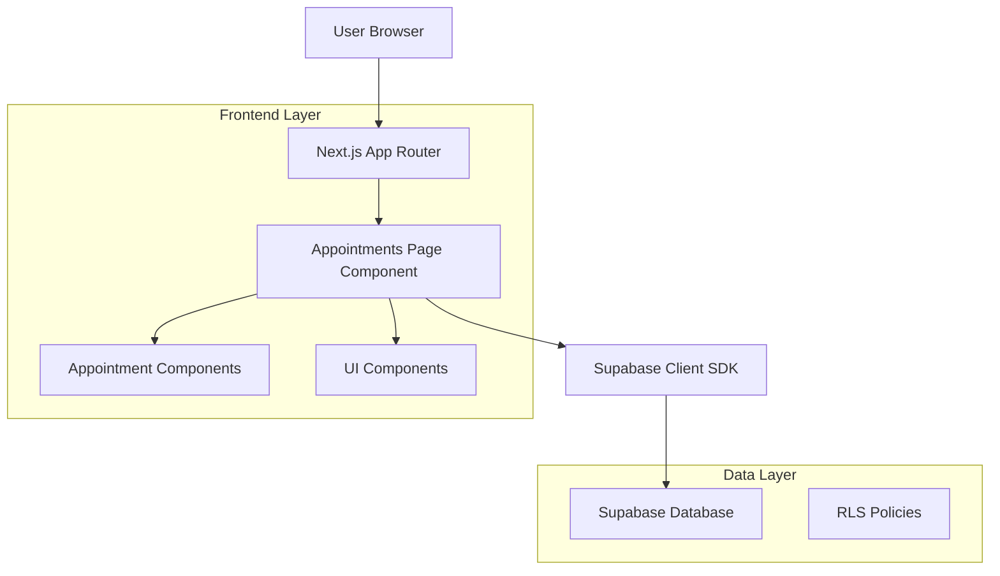
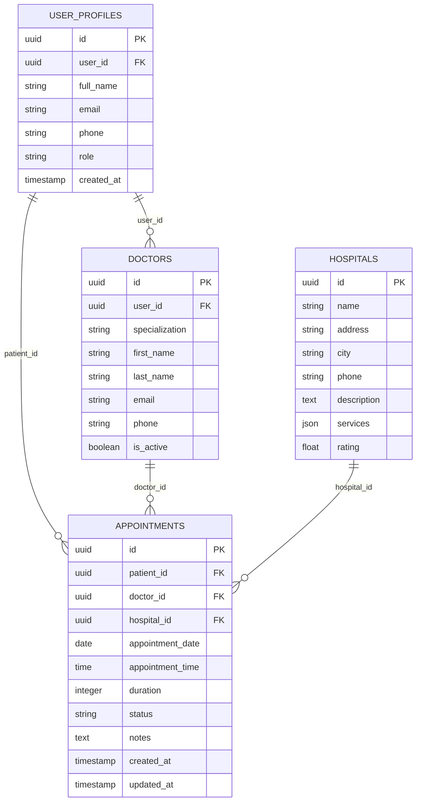

# Appointments Page - Technical Architecture Document

## 1. Architecture Design



## 2. Technology Description

- Frontend: React@18 + Next.js@14 + TypeScript + Tailwind CSS
- Backend: Supabase (PostgreSQL with RLS)
- Authentication: Supabase Auth
- UI Components: Shadcn/ui + Lucide React icons

## 3. Route Definitions

| Route | Purpose |
|-------|---------|
| /appointments | Main appointments page displaying user's appointment list with filtering and search |
| /appointments/[id] | Individual appointment details page (optional future enhancement) |

## 4. API Definitions

### 4.1 Core API Functions

**Get Patient Appointments**
```typescript
getPatientAppointments(patientId: string): Promise<AppointmentWithDetails[]>
```

Request Parameters:
| Param Name | Param Type | isRequired | Description |
|------------|------------|------------|-------------|
| patientId | string | true | The patient's user profile ID |

Response Type:
```typescript
interface AppointmentWithDetails {
  id: string
  patient_id: string
  doctor_id: string
  hospital_id: string
  appointment_date: string
  appointment_time: string
  duration: number
  status: 'pending' | 'confirmed' | 'completed' | 'cancelled' | 'no_show'
  notes: string | null
  created_at: string
  updated_at: string
  doctors: {
    id: string
    specialization: string
    user_profiles: {
      full_name: string | null
    } | null
  } | null
  hospitals: {
    id: string
    name: string
    address: string | null
  } | null
}
```

**Update Appointment Status**
```typescript
updateAppointmentStatus(appointmentId: string, status: string): Promise<Appointment>
```

Request Parameters:
| Param Name | Param Type | isRequired | Description |
|------------|------------|------------|-------------|
| appointmentId | string | true | The appointment ID to update |
| status | string | true | New status: 'pending', 'confirmed', 'completed', 'cancelled', 'no_show' |

**Update Appointment**
```typescript
updateAppointment(appointmentId: string, updates: AppointmentUpdate): Promise<Appointment>
```

Request Parameters:
| Param Name | Param Type | isRequired | Description |
|------------|------------|------------|-------------|
| appointmentId | string | true | The appointment ID to update |
| updates | AppointmentUpdate | true | Fields to update (date, time, notes, etc.) |

## 5. Data Model

### 5.1 Data Model Definition



### 5.2 Data Definition Language

**Appointments Table (already exists)**
```sql
-- Appointments table structure
CREATE TABLE appointments (
    id UUID DEFAULT gen_random_uuid() PRIMARY KEY,
    patient_id UUID REFERENCES user_profiles(id) ON DELETE CASCADE,
    doctor_id UUID REFERENCES doctors(id) ON DELETE CASCADE,
    hospital_id UUID REFERENCES hospitals(id) ON DELETE CASCADE,
    appointment_date DATE NOT NULL,
    appointment_time TIME NOT NULL,
    duration INTEGER DEFAULT 30,
    status TEXT NOT NULL CHECK (status IN ('pending', 'confirmed', 'completed', 'cancelled', 'no_show')) DEFAULT 'pending',
    notes TEXT,
    created_at TIMESTAMP WITH TIME ZONE DEFAULT NOW(),
    updated_at TIMESTAMP WITH TIME ZONE DEFAULT NOW()
);

-- Indexes for performance
CREATE INDEX idx_appointments_patient_id ON appointments(patient_id);
CREATE INDEX idx_appointments_doctor_id ON appointments(doctor_id);
CREATE INDEX idx_appointments_hospital_id ON appointments(hospital_id);
CREATE INDEX idx_appointments_date ON appointments(appointment_date);
CREATE INDEX idx_appointments_status ON appointments(status);

-- Row Level Security Policies
-- Patients can view their own appointments
CREATE POLICY "Patients can view own appointments" ON appointments
    FOR SELECT USING (
        patient_id IN (
            SELECT id FROM user_profiles WHERE user_id = auth.uid() AND role = 'patient'
        )
    );

-- Patients can update their own appointments (limited fields)
CREATE POLICY "Patients can update own appointments" ON appointments
    FOR UPDATE USING (
        patient_id IN (
            SELECT id FROM user_profiles WHERE user_id = auth.uid() AND role = 'patient'
        )
    );

-- Doctors can view appointments assigned to them
CREATE POLICY "Doctors can view assigned appointments" ON appointments
    FOR SELECT USING (
        doctor_id IN (
            SELECT id FROM doctors WHERE user_id = auth.uid()
        )
    );

-- Enable RLS
ALTER TABLE appointments ENABLE ROW LEVEL SECURITY;
```

**Required Views for Efficient Queries**
```sql
-- Create a view for appointment details with related data
CREATE OR REPLACE VIEW appointment_details AS
SELECT 
    a.*,
    up.full_name as patient_name,
    up.email as patient_email,
    up.phone as patient_phone,
    d.specialization,
    dup.full_name as doctor_name,
    h.name as hospital_name,
    h.address as hospital_address,
    h.phone as hospital_phone
FROM appointments a
LEFT JOIN user_profiles up ON a.patient_id = up.id
LEFT JOIN doctors d ON a.doctor_id = d.id
LEFT JOIN user_profiles dup ON d.user_id = dup.user_id
LEFT JOIN hospitals h ON a.hospital_id = h.id;
```