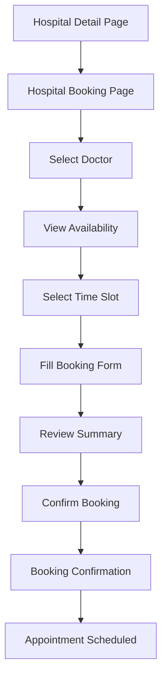

# Hospital Booking Page - Product Requirements Document

## 1. Product Overview
The Hospital Booking Page allows authenticated patients to book appointments with doctors at a specific hospital. This page provides a streamlined booking experience by displaying available doctors, their schedules, and enabling appointment scheduling with real-time availability checking.

The page serves as a critical conversion point in the patient journey, transforming hospital browsing into actual appointment bookings while maintaining the existing design consistency and user experience standards.

## 2. Core Features

### 2.1 User Roles
| Role | Registration Method | Core Permissions |
|------|---------------------|------------------|
| Patient | Email registration with profile completion | Can view hospital details, browse available doctors, book appointments, and manage their bookings |

### 2.2 Feature Module
Our hospital booking page consists of the following main sections:
1. **Hospital Information Header**: Hospital details, contact information, and key statistics
2. **Doctor Selection**: Available doctors list with specializations and ratings
3. **Availability Calendar**: Interactive calendar showing available time slots
4. **Booking Form**: Patient information and appointment details form
5. **Confirmation**: Booking summary and confirmation interface

### 2.3 Page Details
| Page Name | Module Name | Feature description |
|-----------|-------------|---------------------|
| Hospital Booking | Hospital Info Header | Display hospital name, address, contact details, and key metrics (total doctors, specializations available) |
| Hospital Booking | Doctor Selection | List available doctors with photos, names, specializations, experience, ratings, and availability indicators |
| Hospital Booking | Doctor Filter | Filter doctors by specialization, availability, rating, and experience level |
| Hospital Booking | Availability Calendar | Show interactive calendar with available dates and time slots for selected doctor |
| Hospital Booking | Time Slot Selection | Display available time slots for selected date with duration and booking status |
| Hospital Booking | Booking Form | Collect patient details, appointment reason, preferred communication method, and special requirements |
| Hospital Booking | Appointment Summary | Show booking details including doctor, date, time, hospital, and estimated cost |
| Hospital Booking | Payment Integration | Handle appointment booking fees and payment processing |
| Hospital Booking | Confirmation | Display booking confirmation with appointment ID, details, and next steps |
| Hospital Booking | Loading States | Show loading indicators during data fetching and form submission |
| Hospital Booking | Error Handling | Display appropriate error messages for booking failures, validation errors, and network issues |

## 3. Core Process

**Patient Booking Flow:**
1. Patient navigates to hospital booking page from hospital detail page
2. System displays hospital information and available doctors
3. Patient filters/searches for preferred doctor by specialization
4. Patient selects a doctor to view their availability
5. System shows calendar with available dates and time slots
6. Patient selects preferred date and time slot
7. Patient fills out booking form with appointment details
8. System validates form and checks slot availability
9. Patient reviews booking summary and confirms
10. System processes booking and displays confirmation
11. Patient receives booking confirmation and appointment details

## 4. User Interface Design

### 4.1 Design Style
- **Primary Colors**: Blue (#3B82F6) for primary actions, Green (#10B981) for success states
- **Secondary Colors**: Gray (#6B7280) for text, Light blue (#EFF6FF) for backgrounds
- **Button Style**: Rounded corners (8px), solid primary buttons, outlined secondary buttons
- **Font**: Inter font family, 16px base size, 14px for secondary text
- **Layout Style**: Card-based design with clean spacing, responsive grid layout
- **Icons**: Lucide React icons for consistency, medical-themed icons where appropriate

### 4.2 Page Design Overview
| Page Name | Module Name | UI Elements |
|-----------|-------------|-------------|
| Hospital Booking | Hospital Header | Large hospital name, address with map icon, phone with click-to-call, stats cards with doctor count and specializations |
| Hospital Booking | Doctor Cards | Profile photo (circular), name and specialization, experience years, star rating, availability badge, "Select Doctor" button |
| Hospital Booking | Filter Sidebar | Specialization dropdown, availability toggle, rating filter, experience range slider, clear filters button |
| Hospital Booking | Calendar Widget | Month/week view toggle, date picker with available dates highlighted, disabled past dates, loading skeleton |
| Hospital Booking | Time Slots | Grid layout of time buttons, available (blue), booked (gray), selected (dark blue), 30-minute intervals |
| Hospital Booking | Booking Form | Patient info fields, appointment reason textarea, contact preferences radio buttons, special requirements textarea |
| Hospital Booking | Summary Card | Sticky sidebar with selected details, cost breakdown, terms checkbox, primary "Confirm Booking" button |
| Hospital Booking | Confirmation Modal | Success icon, appointment ID, booking details, calendar add button, "View My Appointments" link |

### 4.3 Responsiveness
The page is mobile-first responsive design with:
- Desktop: Two-column layout (main content + sidebar)
- Tablet: Single column with collapsible filters
- Mobile: Stack layout with bottom-fixed booking summary
- Touch-optimized time slot selection and form inputs
- Swipe gestures for calendar navigation on mobile