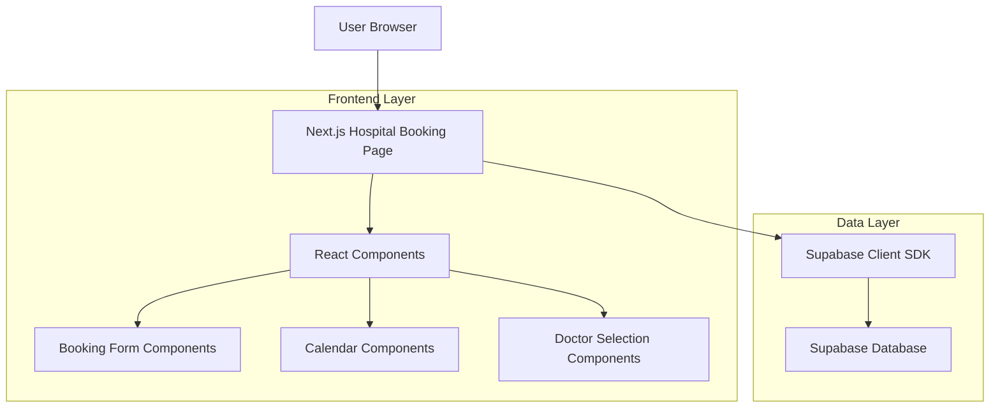
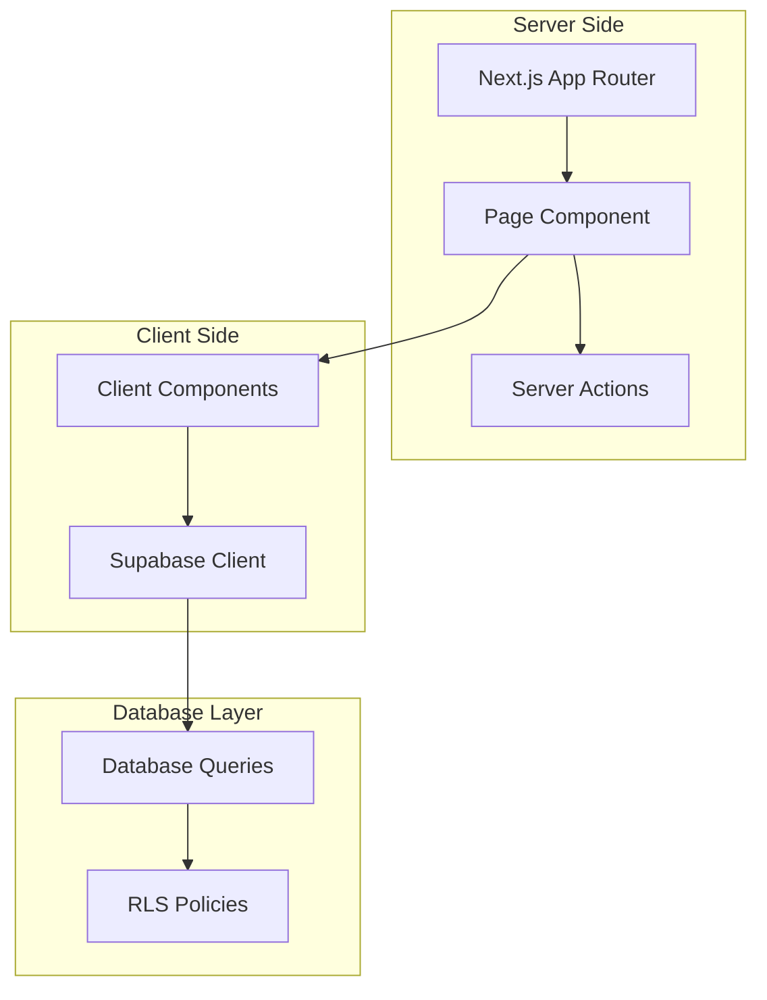
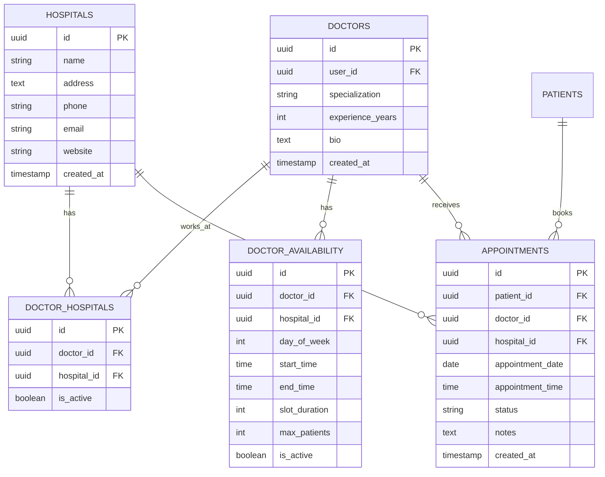

# Hospital Booking Page - Technical Architecture Document

## 1. Architecture Design



## 2. Technology Description
- Frontend: Next.js 14 + React 18 + TypeScript + Tailwind CSS
- Backend: Supabase (PostgreSQL database, Authentication, RLS)
- UI Components: Shadcn/ui components + Lucide React icons
- State Management: React hooks (useState, useEffect) + React Query for data fetching
- Form Handling: React Hook Form with Zod validation
- Date/Time: date-fns for date manipulation and formatting

## 3. Route Definitions
| Route | Purpose |
|-------|---------|
| /hospitals/[id]/book | Hospital booking page for specific hospital ID |
| /hospitals/[id] | Hospital detail page (existing, with "Book Appointment" button) |
| /appointments | Patient appointments dashboard (existing) |
| /doctors | Public doctors listing (existing) |

## 4. API Definitions

### 4.1 Core API Functions

**Hospital and Doctor Data**
```typescript
// Get hospital with available doctors
async function getHospitalWithDoctors(hospitalId: string): Promise<HospitalWithDoctors>

// Get doctor availability for specific date range
async function getDoctorAvailability(doctorId: string, startDate: string, endDate: string): Promise<AvailabilitySlot[]>

// Get available time slots for doctor on specific date
async function getAvailableTimeSlots(doctorId: string, date: string): Promise<TimeSlot[]>
```

**Appointment Booking**
```typescript
// Create new appointment
async function createAppointment(appointmentData: CreateAppointmentData): Promise<Appointment>

// Check slot availability before booking
async function checkSlotAvailability(doctorId: string, date: string, time: string): Promise<boolean>
```

### 4.2 Data Types

```typescript
interface HospitalWithDoctors {
  id: string
  name: string
  address: string
  phone: string
  email: string
  website?: string
  doctors: DoctorWithAvailability[]
}

interface DoctorWithAvailability {
  id: string
  user_profiles: {
    full_name: string
    avatar_url?: string
  }
  specialization: string
  experience_years: number
  rating?: number
  availability_count: number
  next_available_date?: string
}

interface AvailabilitySlot {
  id: string
  doctor_id: string
  hospital_id: string
  day_of_week: number
  start_time: string
  end_time: string
  slot_duration: number
  max_patients: number
  is_active: boolean
}

interface TimeSlot {
  time: string
  available: boolean
  booked_count: number
  max_patients: number
}

interface CreateAppointmentData {
  patient_id: string
  doctor_id: string
  hospital_id: string
  appointment_date: string
  appointment_time: string
  notes?: string
  status: 'pending' | 'confirmed'
}
```

## 5. Server Architecture Diagram



## 6. Data Model

### 6.1 Data Model Definition



### 6.2 Data Definition Language

**Key Tables for Booking Functionality**

```sql
-- Hospital booking queries will use existing tables:
-- hospitals, doctors, doctor_hospitals, doctor_availability, appointments

-- Additional indexes for booking performance
CREATE INDEX IF NOT EXISTS idx_doctor_availability_hospital_day 
ON doctor_availability(hospital_id, day_of_week, is_active);

CREATE INDEX IF NOT EXISTS idx_appointments_doctor_date_time 
ON appointments(doctor_id, appointment_date, appointment_time);

CREATE INDEX IF NOT EXISTS idx_doctor_hospitals_hospital_active 
ON doctor_hospitals(hospital_id, is_active);

-- RLS Policies for booking (existing policies will be used)
-- Patients can view doctor availability and create appointments
-- Doctors can view their availability and appointments
-- Public can view basic hospital and doctor information

-- Sample availability data for testing
INSERT INTO doctor_availability (doctor_id, hospital_id, day_of_week, start_time, end_time, slot_duration, max_patients)
SELECT 
  d.id,
  '33333333-3333-3333-3333-333333333332'::uuid,
  generate_series(1, 5) as day_of_week,
  '09:00'::time,
  '17:00'::time,
  30,
  2
FROM doctors d
WHERE EXISTS (
  SELECT 1 FROM doctor_hospitals dh 
  WHERE dh.doctor_id = d.id 
  AND dh.hospital_id = '33333333-3333-3333-3333-333333333332'::uuid
);
```